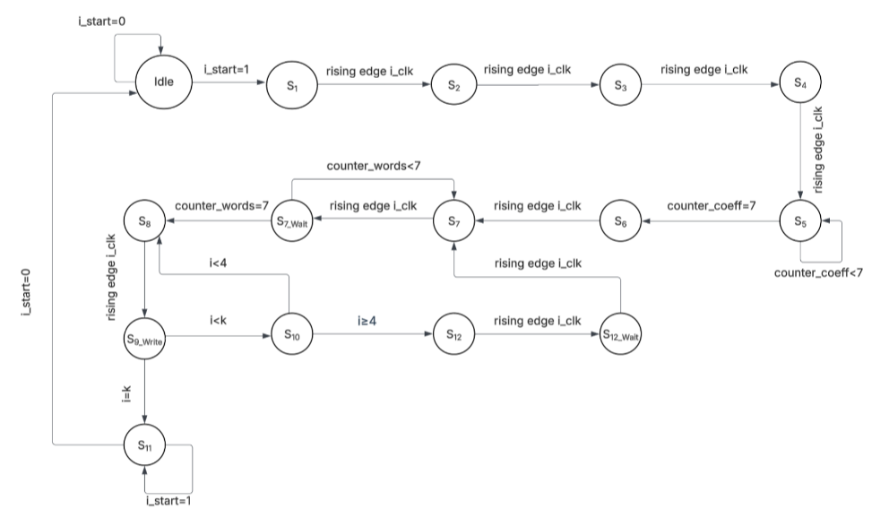
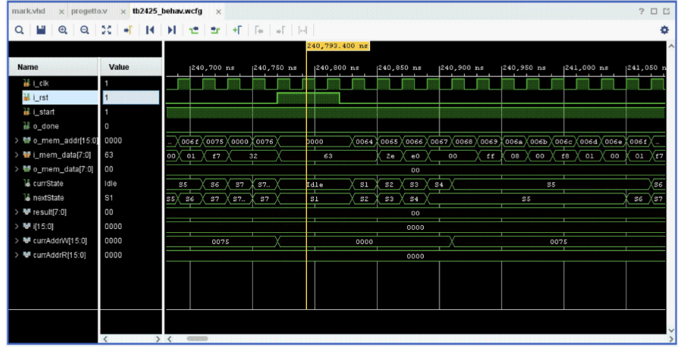
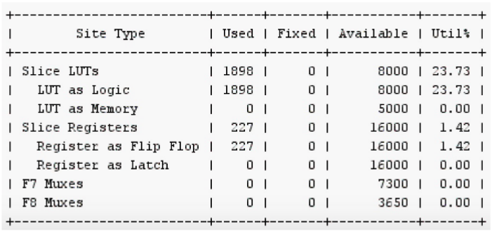

# Progetto di Reti Logiche — Differential Filter in VHDL

<p align="center">
  
  
  
</p>

<p align="center">
  
  
  
  
</p>

---

> Final project ("Prova Finale") for the **Reti Logiche** (Digital Logic Design) course — Politecnico di Milano, A.Y. 2024/2025.
>
> Hardware design and VHDL implementation of a synchronous digital module that interfaces with a single-port RAM to apply a **differential filter** (order 3 or order 5) to an arbitrary-length signed sequence, with saturation and shift-based normalization.

---

## 📖 Table of contents

- [Project overview](#project-overview)
- [Specification summary](#specification-summary)
- [Module interface](#module-interface)
- [Architecture](#architecture)
- [Finite State Machine](#finite-state-machine)
- [Simulation and testing](#simulation-and-testing)
- [Synthesis results](#synthesis-results)
- [How to run](#how-to-run)
- [Author](#author)
- [License](#license)

---

## Project overview

The system reads a signed byte sequence stored in RAM, applies a **differential FIR filter**, and writes the filtered sequence back to memory. Every value falling outside the `[-128, +127]` range is saturated to the interval limit.

The filter follows the formula:

$$f'(i) = \frac{1}{n} \sum_{j=-l}^{+l} C_j \cdot f[j+i]$$

where the order (3 or 5), the coefficients `C_j`, and the normalization factor `n` are all read from memory at runtime — the module is therefore fully generic with respect to the filter configuration.

Two filter orders are supported:

| Order | `l` | Coefficients `c` | Normalization `n` |
|:-----:|:---:|:----------------:|:-----------------:|
| 3 | 2 | `[0, −1, 8, 0, −8, 1, 0]` | 12 |
| 5 | 3 | `[1, −9, 45, 0, −45, 9, −1]` | 60 |

Division by `n` is approximated using only **right shifts and adds**, with sign-aware correction to compensate for the truncation bias on negative numbers (each shift introduces a −1 error on two's-complement negatives, which is corrected by adding +1 to the shifted result).

- `1/12 ≈ 1/16 + 1/64 + 1/256 + 1/1024`
- `1/60 ≈ 1/64 + 1/1024`

---

## Specification summary

Given a base memory address `ADD` provided at start, the memory layout is:

```
ADD       K1  K2               (2 bytes) — sequence length K, K1 is the MSB
ADD + 2   S                    (1 byte)  — filter selector: LSB=0 → order 3, LSB=1 → order 5
ADD + 3   C1 ... C14           (14 bytes)— filter coefficients for both orders
ADD + 17  W1 W2 ... Wk         (K bytes) — input sequence
ADD+17+K  R1 R2 ... Rk         (K bytes) — output sequence (written by the module)
```

Boundary values before `W1` and after `Wk` are treated as `0` during convolution.

---

## Module interface

The module is described by a single entity, `project_reti_logiche`, with a single architecture:

```vhdl
entity project_reti_logiche is
    port (
        i_clk       : in  std_logic;
        i_rst       : in  std_logic;
        i_start     : in  std_logic;
        i_add       : in  std_logic_vector(15 downto 0);
        o_done      : out std_logic;

        o_mem_addr  : out std_logic_vector(15 downto 0);
        i_mem_data  : in  std_logic_vector(7 downto 0);
        o_mem_data  : out std_logic_vector(7 downto 0);
        o_mem_we    : out std_logic;
        o_mem_en    : out std_logic
    );
end project_reti_logiche;
```

**Protocol.** All signals are synchronous on the rising edge of `i_clk`, except `i_rst` which is asynchronous. On reset, `o_done` is driven low. When `i_start` is asserted, the module reads the header + input sequence, computes the filter, writes the result, and finally raises `o_done`. `i_start` remains high until `o_done` is raised; `o_done` remains high until `i_start` returns low.

---

## Architecture

The design is structured as a classic **datapath + control unit** (Moore FSM) partition:

- **Control unit** — a Moore finite state machine driving the memory interface (`o_mem_addr`, `o_mem_en`, `o_mem_we`) and the datapath control signals.
- **Datapath** — registers for the header (K, S, coefficients), the sliding window of samples required by the convolution, the running accumulator for `∑Cj · f[j+i]`, and the saturation stage.
- **Memory interface** — read/write access to the external single-port block RAM instantiated in the test bench.


Design highlights:

- Register width for the pre-normalization accumulator is sized to hold the worst-case sum without overflow (order-5 coefficients dominate the required bit-width).
- Multiplications by coefficients are decomposed into shift-and-add operations, avoiding inference of DSP multipliers.
- Division by `n` is implemented as a cascade of right shifts with the sign-aware +1 correction described in the specification.
- Saturation to `[-128, +127]` is applied as the final stage before writing back to memory.

---

## Finite State Machine

The control unit is a Moore FSM covering the full flow: idle → read header → read coefficients → sliding-window convolution → normalization + saturation → memory write-back → done.

<p align="center">
  
</p>

---


## Simulation and testing

The module was verified against **all six examples** provided in the official specification (both order-3 and order-5 filters, including edge cases with `K` values close to the minimum and long sequences), plus additional custom test benches designed to stress:

- Minimum-length sequences (`K = 7`).
- Sequences producing saturation on both positive and negative bounds.
- Consecutive `START` cycles without intermediate `RESET`.
- Asynchronous `RESET` assertion mid-computation.

<p align="center">
  
</p>

All test benches passed in both **behavioral simulation** and **post-synthesis functional simulation** using Xilinx Vivado.

---

## Synthesis results

Synthesis was performed with **Xilinx Vivado** targeting the default Artix-7 device used by the course.

<p align="center">
  
</p>

---

## How to run

### Requirements

- Xilinx Vivado 2020.2 or later (any edition, including the free WebPACK).

### Behavioral simulation

1. Open Vivado and create a new RTL project.
2. Add `src/project_reti_logiche.vhd` as a design source.
3. Add one of the files in `testbench/` as a simulation source.
4. Run **Run Simulation → Run Behavioral Simulation**.
5. Observe `o_done` going high and inspect the RAM contents at the expected output addresses.

### Synthesis

Click **Run Synthesis** in the Vivado flow navigator. The design has no external constraints and can be synthesized out of the box.

---

## Author

- **[Isabel Reguera]** — [isabel.reguera@mail.polimi.it] 
- **[Alice Piacentini]** — [alice.piacentini@mail.polimi.it] 
---

## License

This project is released for academic and educational purposes. All rights reserved to the author.

---

## Acknowledgements

Project developed for the **Reti Logiche** course held at Politecnico di Milano, A.Y. 2024/2025, under  Prof. Palermo.
